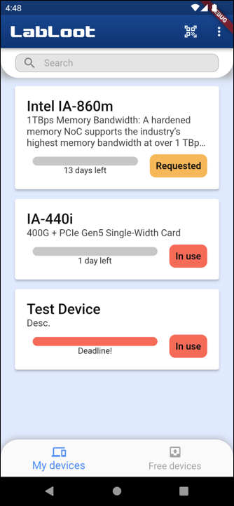
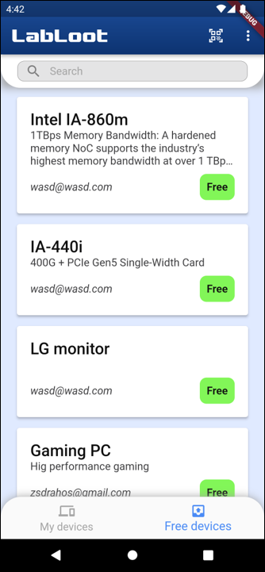
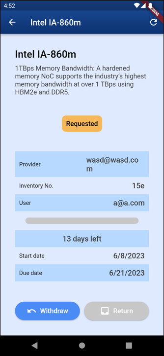
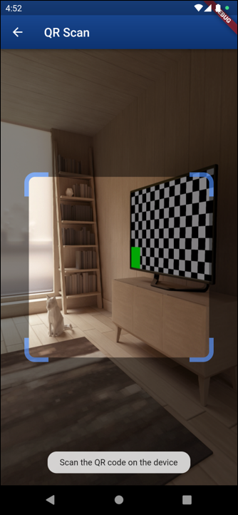
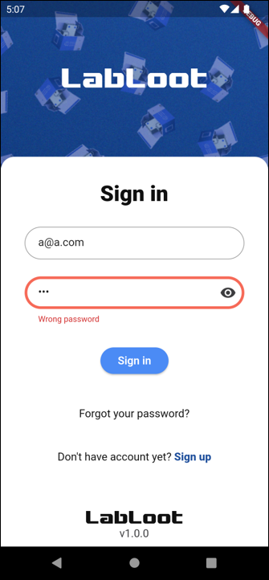
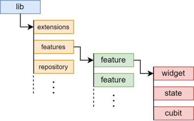

# LabLoot_flutter

Az eszközök kölcsönzése és a hozzájuk kapcsolódó adminisztráció sok esetben kihívást
jelenthet mind a kölcsönzők, mind pedig a bérlők számára. A hagyományos papíralapú vagy
félautomatizált rendszerek gyakran lassúak, fáradságosak és hajlamosak a hibákra. Ezért
szükséges lehet az olyan hatékony digitális rendszerek bevezetése, amelyek lehetővé teszik egy
eszközpark könnyű nyilvántartását, az eszközök bérlését és az adminisztrációs folyamatok
egyszerűsítését.

#### Saját eszközök listája
 

#### Szabad eszközök listája
 

#### Eszköz foglalása
 

#### Eszköz részletei
 

#### QR kód olvasó
 

#### Bejelentkezés
 

## App felépítése

Állapotkezelés: `Cubit`  
Függőséginjektálás: `Provider`  
Felhasználók kezelése: `Firebase-auth`  
Model osztályok: `Equatable, JsonSerializable`  

## Forráskód
A forráskód eléréséhez kérlek keress meg e-mail-ben.
